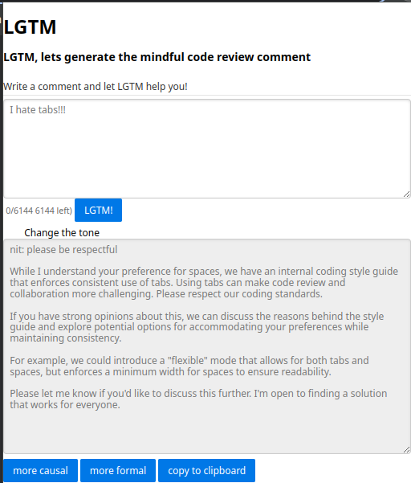

# LGTM

## Description

Let's generate the meaningful code review comments automatically.

It is a chrome extension that helps to improve the quality of code review comments
and was initially developed for the [Google Chrome Built-in AI Challenge](https://devpost.com/software/lgtm-fmnqdz#updates).

## Usage

### Activate custom flags

1. Open the Chrome browser and go to `chrome://flags/`.
2. Enable Prompt APIs

### Install the extension

1. Download the repository.

2. Open the Chrome browser and go to `chrome://extensions/`.

3. Enable the `Developer mode` in the top right corner.

4. Click on the `Load unpacked` button and select the `lgtm` directory.

## License

MIT
